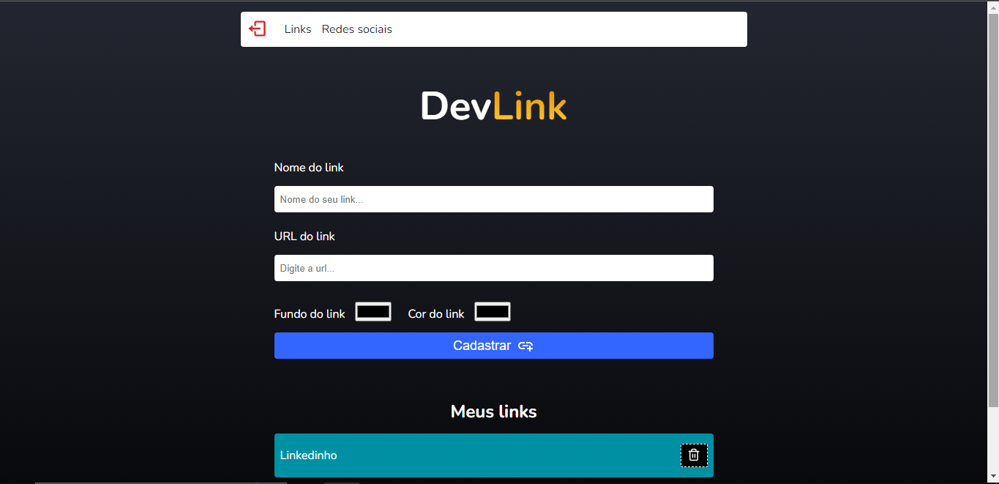

<h1 align="center">
   Gerenciador de links de  mídias sociais
</h1>

## 📃 Sobre

<p>Gerenciador de links utilizando a biblioteca ReactJS com Firebase para armazenar os links das redes sociais. A aplicação foi baseada nas funcionalidades do Linktree, basicamente as funcionalidades são: o
usuário pode se cadastrar e logar no sistema. Dentro do sistema o usuário pode cadastrar um novo link colocando o nome, url, cor de fundo do texto e a cor da fonte do link.
Também possui uma parte para inserir Facebook, Instagram e Youtube de forma individual. </p>

## 🚀 Tecnologias utilizadas

O projeto foi desenvolvido com as seguintes tecnologias:

- ReactJS
- TypeScript
- Firebase

---

## Rotas da aplicação

- admin
- login
- admin/social

## 📷 Imagens

<h1 align="center">
    
</h1>

## 📁 Como baixar o projeto

```bash

    # Clonar o repositório
    $ git clone https://github.com/EnzoXavier1001/dev-links

    # Entrar no diretório
    $ cd devlink

    # Baixar dependências
    $ yarn install ou npm install

    # Executar o comando
    $ npm run dev

```
